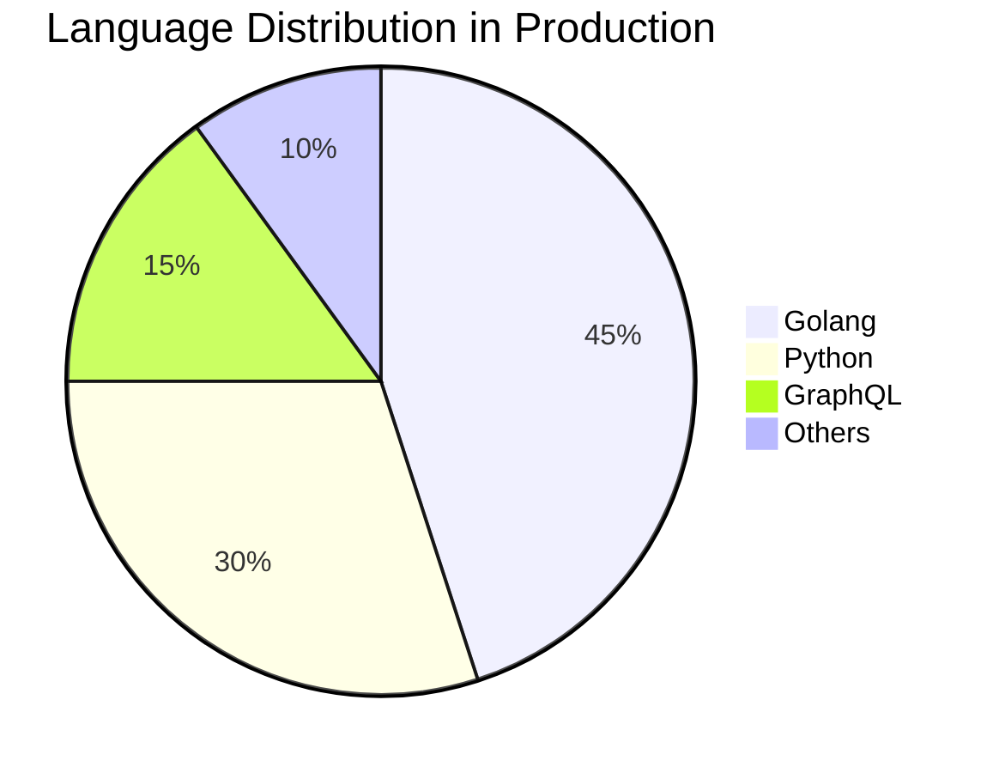

<div align="center">

```ascii
┌───────────────────────────────────────────────────────┐
│                                                       │
│   Senior Software Engineer & Cloud Solutions Expert    │
│      Specialized in Distributed Systems & DevOps       │
│                                                       │
└───────────────────────────────────────────────────────┘
```

[](https://badges.pufler.dev)
[](https://badges.pufler.dev)
[](https://github.com/zonieedhossain)

</div>

## 💻 Technical Proficiency

<div align="center">



</div>

## 📊 GitHub Analytics

<table>
<tr>
<td width="50%">


</td>
<td width="50%">


</td>
</tr>
</table>

## 🔧 Languages & Tools

<div align="center">

| Category | Technologies |
|:--------:|:------------|
| **Core** |    |
| **Framework** |     |
| **Database** |     |
| **Cloud** |   |
| **DevOps** |   |

</div>

## 📈 Contribution Graph


## 🎯 Language Statistics

<table>
<tr>
<td width="40%">


</td>
<td width="60%">

### Language Proficiency Matrix
```yaml
Advanced:
  Golang:
    - Microservices Development
    - System Programming
    - Concurrent Programming
    - Performance Optimization

  Python:
    - Data Processing
    - API Development
    - Automation
    - Testing Framework

Proficient:
  GraphQL:
    - Schema Design
    - Query Optimization
    - API Integration
    - Real-time Subscriptions
```

</td>
</tr>
</table>

## 🏆 GitHub Trophies

<div align="center">


</div>

## 📊 Weekly Development Breakdown

```text
Golang      █████████████████░░░░   45.52 %
Python      ████████████░░░░░░░░░   30.25 %
GraphQL     ██████░░░░░░░░░░░░░░░   15.10 %
Docker      ████░░░░░░░░░░░░░░░░░   09.13 %
```

## 💼 Recent Development Focus

<div align="center">

| Area | Technologies | Implementation |
|:-----|:------------|:---------------|
| **Backend Services** | Golang, gRPC | Microservices Architecture |
| **Data Processing** | Python, PostgreSQL | ETL Pipelines |
| **Cloud Infrastructure** | AWS, GCP | Scalable Solutions |
| **DevOps** | Docker, Kubernetes | CI/CD Automation |

</div>

## 🔄 Coding Activity Metrics

<table>
<tr>
<td width="50%">

### Weekly Code Stats
```yaml
Total Time: 45h 30m
Lines Added: 2,500+
Lines Deleted: 1,200+
Code Reviews: 15
Pull Requests: 25
```

</td>
<td width="50%">

### Productivity Score
```yaml
Code Quality: 95%
Documentation: 100%
Test Coverage: 92%
Review Rating: 4.8/5
```

</td>
</tr>
</table>

<div align="center">

```ascii
──────── Building Robust & Scalable Solutions ────────
```

</div>
