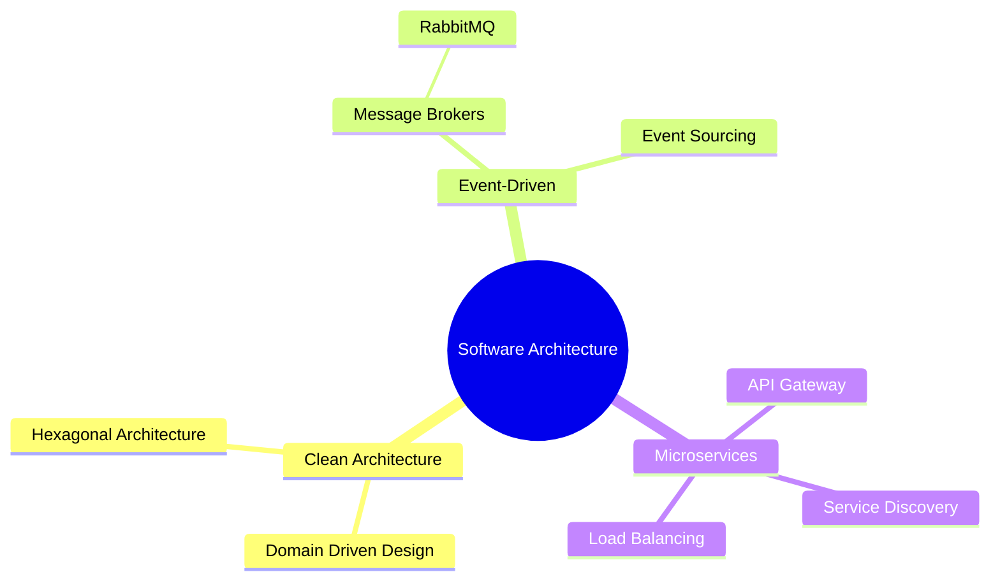

<div align="center">
  
  <!-- Header with animated typing effect -->
  [](https://git.io/typing-svg)
  
  <!-- Custom badges with gradients -->
  <p>
    
    
    
  </p>

  <!-- Profile Views Counter -->
  

</div>

<br>

<!-- About Me Section with Custom Design -->
<details open>
<summary><h2>🌟 About Me</h2></summary>
<table>
<tr>
<td>
  
```go
type SoftwareEngineer struct {
    Name            string
    Role            string
    Language        []string
    Cloud           []string
    Architecture    []string
    Experience      string
}

func main() {
    me := SoftwareEngineer{
        Name:         "Zonieed",
        Role:         "Senior Software Engineer",
        Language:     []string{"Golang", "Python", "GraphQL"},
        Cloud:        []string{"AWS", "GCP"},
        Architecture: []string{"Microservices", "Event-Driven"},
        Experience:   "5+ years",
    }
}
```
</td>
<td>

🔭 **Current Focus:** Building scalable microservices  
🌱 **Learning:** Advanced Cloud Native Patterns  
💬 **Expertise:** Distributed Systems & Cloud Architecture  
⚡ **Fun fact:** Code, Coffee, Repeat!

</td>
</tr>
</table>
</details>

<!-- Tech Stack with Modern Layout -->
<details open>
<summary><h2>🛠️ Technical Arsenal</h2></summary>

<div align="center">

| Category | Technologies |
|:--------:|:------------|
| **Core Languages** |    |
| **Frameworks** |     |
| **Databases** |     |
| **Cloud & DevOps** |     |

</div>
</details>

<!-- Architecture & Expertise -->
<details open>
<summary><h2>🏗️ Architecture & Expertise</h2></summary>

<div align="center">



</div>
</details>

<!-- GitHub Stats with Custom Theme -->
<details open>
<summary><h2>📊 GitHub Analytics</h2></summary>

<div align="center">
  
  
  
  
</div>
</details>

<!-- Featured Projects -->
<details open>
<summary><h2>🎯 Featured Projects</h2></summary>

<div align="center">
<table>
<tr>
<td width="50%">
<h3 align="center">Project 1</h3>
<div align="center">
<a href="[project-1-link]" target="_blank"></a>
<p>
<a href="[project-1-github-link]" target="_blank">

</a>
<a href="[project-1-live-link]" target="_blank">

</a>
</p>
<p><strong>Golang, gRPC, PostgreSQL</strong> - Microservices project description goes here</p>
</div>
                                                                                      
</td>

<td width="50%">
<h3 align="center">Project 2</h3>
<div align="center">
<a href="[project-2-link]" target="_blank"></a>
<p>
<a href="[project-2-github-link]" target="_blank">

</a>
<a href="[project-2-live-link]" target="_blank">

</a>
</p>
<p><strong>Python, Django, Redis</strong> - Web application project description goes here</p>
</div>
</td>
</tr>
</table>
</div>
</details>

<!-- Connect Section -->
<details open>
<summary><h2>🤝 Let's Connect</h2></summary>
<div align="center">
  
[](https://linkedin.com/in/[your-linkedin])
[](https://twitter.com/[your-twitter])
[](https://medium.com/@[your-medium])
[](https://[your-portfolio])

</div>
</details>

<!-- Footer -->
<div align="center">

<br />


</div>
