<div align="center">
  
```ascii
                    SOFTWARE ENGINEER & CLOUD ARCHITECT
┌────────────────────────────────────────────────────────────┐
│                                                            │
│   ███████╗ ██████╗ ███╗   ██╗██╗███████╗███████╗██████╗   │
│   ╚══███╔╝██╔═══██╗████╗  ██║██║██╔════╝██╔════╝██╔══██╗  │
│     ███╔╝ ██║   ██║██╔██╗ ██║██║█████╗  █████╗  ██║  ██║  │
│    ███╔╝  ██║   ██║██║╚██╗██║██║██╔══╝  ██╔══╝  ██║  ██║  │
│   ███████╗╚██████╔╝██║ ╚████║██║███████╗███████╗██████╔╝  │
│   ╚══════╝ ╚═════╝ ╚═╝  ╚═══╝╚═╝╚══════╝╚══════╝╚═════╝   │
│                                                            │
└────────────────────────────────────────────────────────────┘
```

</div>

<div align="center">
  <a href="[LinkedIn URL]"></a>
  <a href="mailto:[your-email]"></a>
</div>

<br>

## `⚡ CORE COMPETENCIES`

<table>
<tr>
<td>

### `🔋 BACKEND DEVELOPMENT`
```yaml
Languages:
  - Golang [Advanced]
  - Python [Advanced]
  - GraphQL [Proficient]

Frameworks:
  - gRPC
  - Chi
  - Echo
  - Django

Testing:
  - Karate Framework
  - Unit Testing
  - Integration Testing
  - E2E Testing
```

</td>
<td>

### `☁️ CLOUD & DEVOPS`
```yaml
Cloud Platforms:
  - Amazon Web Services (AWS)
  - Google Cloud Platform (GCP)

Containerization:
  - Docker
  - Kubernetes
  - Container Orchestration
  - Microservices Architecture

CI/CD:
  - GitLab CI
  - GitHub Actions
  - Jenkins
```

</td>
</tr>
</table>

## `🎯 PROFESSIONAL SUMMARY`

```typescript
class SoftwareArchitect {
    private readonly specialization: string[] = [
        "Microservices Architecture",
        "Distributed Systems",
        "Cloud-Native Solutions",
        "Event-Driven Architecture"
    ];

    private readonly experience: {
        years: number;
        level: string;
        focus: string[];
    } = {
        years: 5,
        level: "Senior",
        focus: [
            "High-Performance Systems",
            "Scalable Solutions",
            "System Integration",
            "Technical Leadership"
        ]
    };
}
```

## `💾 DATABASE & STORAGE`

<div align="center">

| Type | Technologies |
|:---:|:---|
| **SQL** |   |
| **NoSQL** |  |
| **Caching** |  |
| **Message Broker** |  |

</div>

## `🏗️ ARCHITECTURE PATTERNS`

<div align="center">



</div>

```mermaid
graph LR
    A[Clean Architecture] --> B[Domain Layer]
    A --> C[Application Layer]
    A --> D[Infrastructure Layer]
    E[Event-Driven] --> F[Message Broker]
    E --> G[Event Sourcing]
    H[Microservices] --> I[API Gateway]
    H --> J[Service Mesh]
    H --> K[Load Balancer]
    style A fill:#2d3748,stroke:#4a5568
    style E fill:#2d3748,stroke:#4a5568
    style H fill:#2d3748,stroke:#4a5568
```

## `📊 PERFORMANCE METRICS`

<div align="center">
<table>
<tr>
<td width="50%">


</td>
<td width="50%">


</td>
</tr>
</table>
</div>

## `🌟 SIGNATURE PROJECTS`

<div align="center">
<table>
<tr>
<td width="50%">

<h3 align="center">Enterprise Microservices Platform</h3>
<div align="center">
<a href="[project-link]"></a>
<br>
<br>
<p>
<a href="[github-link]">

</a>
</p>
<p><strong>Golang • gRPC • PostgreSQL</strong></p>
<p align="center">
Enterprise-grade microservices platform handling high-throughput transactions with advanced monitoring and scaling capabilities.
</p>
</div>

</td>
<td width="50%">

<h3 align="center">Cloud-Native Analytics Engine</h3>
<div align="center">
<a href="[project-link]"></a>
<br>
<br>
<p>
<a href="[github-link]">

</a>
</p>
<p><strong>Python • AWS • Event-Driven</strong></p>
<p align="center">
Scalable analytics engine processing real-time data streams with event-sourcing architecture.
</p>
</div>

</td>
</tr>
</table>
</div>

## `📫 PROFESSIONAL CONTACT`

<div align="center">

For professional inquiries and collaboration opportunities:

[](mailto:[your-email])
[](https://calendly.com/[your-calendar])
[](https://[your-portfolio])

</div>

<br>

<div align="center">

```ascii
───── Thank you for visiting my profile ─────
```

</div>
