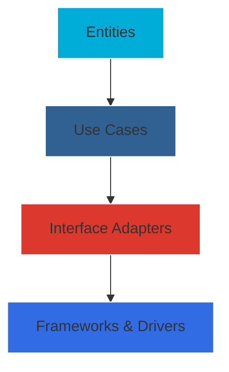

<div align="center">

# Technical Expertise & Stack

```ascii
┌─────────────────────────────────────────────────────────┐
│                                                         │
│   🚀 Senior Software Engineer & Cloud Solutions Expert   │
│          Specializing in Distributed Systems            │
│                                                         │
└─────────────────────────────────────────────────────────┘
```

</div>

## 🎯 Core Technologies

### Programming Languages & Tools

<div align="center">

| Category | Technologies | Experience Level |
|:--------:|:------------|:-----------------|
| **Primary** |  | Advanced - Microservices, APIs, System Programming |
| **Secondary** |  | Advanced - Data Processing, Automation |
| **Query** |  | Proficient - API Development, Data Querying |

</div>

## 🛠 Development Framework Expertise

<table>
<tr>
<td width="50%">

### Backend Frameworks
```yaml
gRPC:
  - High-performance RPC framework
  - Protocol Buffers
  - Service Definition
  - Bi-directional streaming

Chi (Go):
  - Lightweight router
  - Middleware support
  - RESTful APIs
  - Request handling

Echo (Go):
  - High performance
  - Minimalist framework
  - Extensible middleware
  - API development

Django (Python):
  - Full-stack framework
  - Admin interface
  - ORM
  - Authentication
```

</td>
<td width="50%">

### Testing Frameworks
```yaml
Karate:
  - API Testing
  - Performance Testing
  - Behavior Driven Development
  - Test Automation

Additional Testing:
  - Unit Testing
  - Integration Testing
  - E2E Testing
  - Load Testing
  - Stress Testing
```

</td>
</tr>
</table>

## 💾 Database & Storage Solutions

### Relational Databases
<div align="center">

| Database | Use Cases & Expertise |
|:--------:|:--------------------|
|  | • Transaction Processing<br>• ACID Compliance<br>• Complex Queries<br>• Data Warehousing |
|  | • JSON Storage<br>• Full-Text Search<br>• Geographical Data<br>• High Concurrency |

</div>

### NoSQL & Caching
<div align="center">

| Technology | Implementation Areas |
|:----------:|:-------------------|
|  | • Graph Databases<br>• Document Store<br>• Key-Value Pairs |
|  | • Session Management<br>• Caching Layer<br>• Real-time Analytics |

</div>

## ☁️ Cloud & Infrastructure

### Cloud Platforms
<table>
<tr>
<td width="50%">

### Google Cloud Platform (GCP)
```yaml
Services:
  - Compute Engine
  - Cloud Run
  - Cloud Storage
  - Cloud SQL
  - Pub/Sub
  - Cloud Functions
  - Container Registry
```

</td>
<td width="50%">

### Amazon Web Services (AWS)
```yaml
Services:
  - EC2
  - S3
  - RDS
  - Lambda
  - ECS
  - CloudWatch
  - Route 53
```

</td>
</tr>
</table>

## 🐳 Containerization & Orchestration

<div align="center">

| Technology | Expertise Areas |
|:----------:|:---------------|
|  | • Container Creation<br>• Multi-stage Builds<br>• Docker Compose<br>• Image Optimization |
|  | • Cluster Management<br>• Service Deployment<br>• Auto-scaling<br>• Load Balancing |

</div>

## 🏗 Architecture Patterns

### Clean Architecture


### Event-Driven Architecture
<div align="center">

| Component | Implementation |
|:---------:|:--------------|
|  | • Message Queuing<br>• Event Broadcasting<br>• Dead Letter Exchange<br>• Message Routing |
| Event Patterns | • Event Sourcing<br>• CQRS<br>• Pub/Sub<br>• Message Streams |

</div>

## 📈 Performance & Monitoring

```yaml
Metrics:
  - Application Performance Monitoring
  - Resource Utilization
  - Error Tracking
  - User Analytics

Tools:
  - Prometheus
  - Grafana
  - ELK Stack
  - New Relic
```

<div align="center">

```ascii
──────────────────────────────────
  Building Scalable Solutions with
    Enterprise-Grade Technology
──────────────────────────────────
```

</div>
