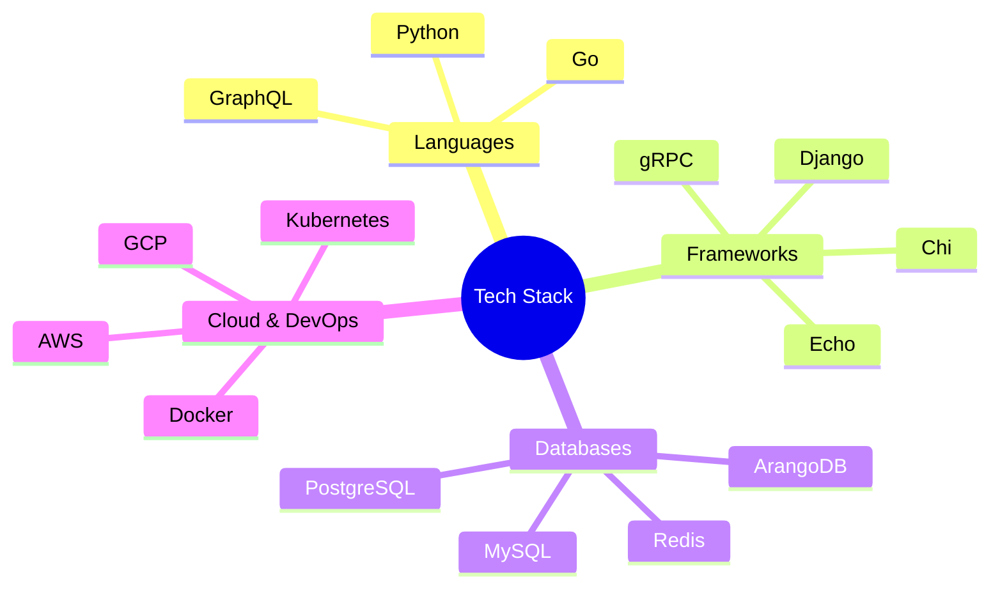

# Hi there! I'm Zonieed 👋

Senior Software Engineer specializing in Backend Development and Cloud Architecture

## 🚀 Tech Stack

## 📊 GitHub Stats

## 💻 Most Used Languages

## 🛠️ Skills & Tools

### Programming Languages

### Frameworks

### Databases

### Cloud & DevOps

## 🎯 Core Competencies

<table>
<tr>
<td>

### Backend Development
- Microservices Architecture
- API Development
- System Design
- Performance Optimization

</td>
<td>

### Cloud & DevOps
- Infrastructure as Code
- CI/CD Pipelines
- Container Orchestration
- Cloud Architecture

</td>
</tr>
</table>

## 📫 Get in Touch

Feel free to connect with me for collaboration opportunities!

